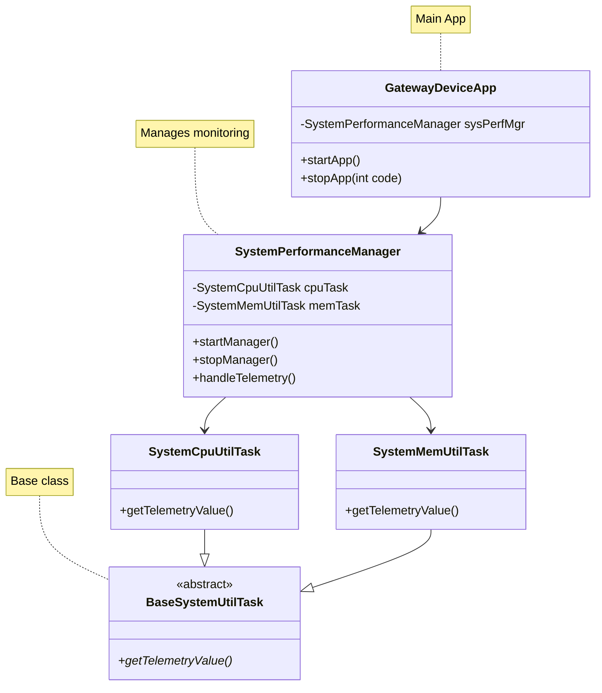

# Gateway Device Application (Connected Devices)

## Overview

This implementation adds comprehensive system performance monitoring capabilities to the Gateway Device App (GDA), enabling continuous real-time tracking of CPU and memory utilization on the host system. The implementation creates a hierarchical architecture where the SystemPerformanceManager orchestrates scheduled telemetry collection through two specialized monitoring tasks: SystemCpuUtilTask for CPU load average tracking and SystemMemUtilTask for JVM heap memory utilization. These components work together to collect performance metrics at configurable intervals (default 5 seconds), logging vital system health data that provides insights into the gateway device's operational status and resource consumption patterns. The modular design allows the GDA to monitor its own performance footprint while maintaining minimal overhead, ensuring the monitoring system itself doesn't significantly impact the metrics being collected.

The implementation leverages Java's Management Extensions (JMX) through the ManagementFactory API to access low-level system metrics without requiring external dependencies or native code. The SystemPerformanceManager initializes a ScheduledExecutorService thread pool that executes the handleTelemetry() method at fixed intervals configured through the PiotConfig.props file. When invoked, this method calls getTelemetryValue() on both the SystemCpuUtilTask (which retrieves system load average via getOperatingSystemMXBean()) and SystemMemUtilTask (which calculates heap memory percentage using getMemoryMXBean()). Both task classes extend the abstract BaseSystemUtilTask, implementing the Template Method design pattern where the base class defines the common structure (name, typeID, getters) while subclasses provide specific metric collection logic. The GatewayDeviceApp integrates this functionality by instantiating the SystemPerformanceManager in its constructor and calling startManager() during application startup and stopManager() during shutdown, ensuring clean lifecycle management with proper resource cleanup and thread termination.

## Test Environment

- **Java Version:** 17.0.16
- **Build Tool:** Maven 3.8.7
- **IDE:** Eclipse with JUnit 4
- **OS:** Linux (Ubuntu)
- **Date:** October 6, 2025

## Code Repository and Branch
- https://github.com/donald4u/gda-java-components/tree/labmodule02

## Class Diagram


## Tests Executed

### 1. ConfigUtilDefaultTest

**Purpose:** Verify configuration utility can load default configuration files.

**Location:** `src/test/java/programmingtheiot/unit/common/ConfigUtilDefaultTest.java`

**Results:**
```
Runs: 7/7
Errors: 0
Failures: 0
Status: PASSED ✓
Execution Time: 0.209 seconds
```

**Test Methods:**
- Configuration loading
- Property retrieval
- Integer value parsing
- Boolean value parsing
- Default value handling
- Section-based configuration
- Property validation

---

### 2. ConfigUtilCustomTest

**Purpose:** Verify configuration utility can load custom configuration and credential files.

**Location:** `src/test/java/programmingtheiot/unit/common/ConfigUtilCustomTest.java`

**Results:**
```
Runs: 7/7
Errors: 0
Failures: 0
Status: PASSED ✓
Execution Time: 0.113 seconds
```

**Console Output:**
```
INFO: Attempting to load cred file: .../ValidTestConfig.props
INFO: Successfully loaded credentials from file: src/test/java/programmingtheiot/unit/common/DummyCredFile.props
```

---

### 3. GatewayDeviceAppTest

**Purpose:** Integration test for main GDA application lifecycle.

**Location:** `src/test/java/programmingtheiot/integration/app/GatewayDeviceAppTest.java`

**Results:**
```
Runs: 1/1
Errors: 0
Failures: 0
Status: PASSED ✓
Execution Time: 65 seconds
```

**Console Output:**
```
Oct 06, 2025 5:24:05 PM programmingtheiot.gda.app.GatewayDeviceApp <init>
INFO: Initializing GDA...
Oct 06, 2025 5:24:05 PM programmingtheiot.gda.app.GatewayDeviceApp startApp
INFO: Starting GDA...
Oct 06, 2025 5:24:05 PM programmingtheiot.gda.system.SystemPerformanceManager startManager
INFO: SystemPerformanceManager is starting...
Oct 06, 2025 5:24:05 PM programmingtheiot.gda.app.GatewayDeviceApp startApp
INFO: GDA started successfully.
Oct 06, 2025 5:25:10 PM programmingtheiot.gda.app.GatewayDeviceApp stopApp
INFO: Stopping GDA...
Oct 06, 2025 5:25:10 PM programmingtheiot.gda.system.SystemPerformanceManager stopManager
INFO: SystemPerformanceManager is stopped.
Oct 06, 2025 5:25:10 PM programmingtheiot.gda.app.GatewayDeviceApp stopApp
INFO: GDA stopped successfully with exit code 0.
```

**Verification:**
- Application initialized successfully
- SystemPerformanceManager started
- Application ran for 65 seconds
- Clean shutdown with exit code 0

---

### 4. SystemPerformanceManagerTest

**Purpose:** Verify SystemPerformanceManager can start, run, and stop correctly.

**Location:** `src/test/java/programmingtheiot/integration/system/SystemPerformanceManagerTest.java`

**Results:**
```
Runs: 1/1
Errors: 0
Failures: 0
Status: PASSED ✓
Execution Time: 60 seconds
```

**Console Output:**
```
Oct 06, 2025 5:41:22 PM programmingtheiot.gda.system.SystemPerformanceManager startManager
INFO: SystemPerformanceManager is starting...
Oct 06, 2025 5:42:22 PM programmingtheiot.gda.system.SystemPerformanceManager stopManager
INFO: SystemPerformanceManager is stopped.
```

**Verification:**
- Manager started successfully
- Ran for configured duration (60 seconds)
- Stopped cleanly without errors

---

### 5. SystemCpuUtilTaskTest

**Purpose:** Verify CPU utilization monitoring functionality.

**Location:** `src/test/java/programmingtheiot/unit/system/SystemCpuUtilTaskTest.java`

**Results:**
```
Runs: 5/5
Errors: 0
Failures: 0
Status: PASSED ✓
Execution Time: < 1 second
```

**Console Output:**
```
Oct 06, 2025 5:44:31 PM programmingtheiot.unit.system.SystemCpuUtilTaskTest testGetTelemetryValue
INFO: Test 1: CPU Util: 1.09375
Oct 06, 2025 5:44:31 PM programmingtheiot.unit.system.SystemCpuUtilTaskTest testGetTelemetryValue
INFO: Test 2: CPU Util: 1.09375
Oct 06, 2025 5:44:31 PM programmingtheiot.unit.system.SystemCpuUtilTaskTest testGetTelemetryValue
INFO: Test 3: CPU Util: 1.09375
Oct 06, 2025 5:44:31 PM programmingtheiot.unit.system.SystemCpuUtilTaskTest testGetTelemetryValue
INFO: Test 4: CPU Util: 1.09375
Oct 06, 2025 5:44:31 PM programmingtheiot.unit.system.SystemCpuUtilTaskTest testGetTelemetryValue
INFO: Test 5: CPU Util: 1.09375
```

**Verification:**
- Successfully retrieved system CPU load average
- Consistent readings across multiple tests (1.09375)
- Value represents system load on Linux (via ManagementFactory)

---

### 6. SystemMemUtilTaskTest

**Purpose:** Verify JVM memory utilization monitoring functionality.

**Location:** `src/test/java/programmingtheiot/unit/system/SystemMemUtilTaskTest.java`

**Results:**
```
Runs: 5/5
Errors: 0
Failures: 0
Status: PASSED ✓
Execution Time: < 1 second
```

**Console Output:**
```
Oct 06, 2025 5:45:33 PM programmingtheiot.unit.system.SystemMemUtilTaskTest testGetTelemetryValue
INFO: Test 1: Memory Util: 0.1270571
Oct 06, 2025 5:45:33 PM programmingtheiot.unit.system.SystemMemUtilTaskTest testGetTelemetryValue
INFO: Test 2: Memory Util: 0.1270571
Oct 06, 2025 5:45:33 PM programmingtheiot.unit.system.SystemMemUtilTaskTest testGetTelemetryValue
INFO: Test 3: Memory Util: 0.1270571
Oct 06, 2025 5:45:33 PM programmingtheiot.unit.system.SystemMemUtilTaskTest testGetTelemetryValue
INFO: Test 4: Memory Util: 0.1270571
Oct 06, 2025 5:45:33 PM programmingtheiot.unit.system.SystemMemUtilTaskTest testGetTelemetryValue
INFO: Test 5: Memory Util: 0.1270571
```

**Verification:**
- Successfully retrieved JVM heap memory usage
- Consistent readings across multiple tests (12.71% utilization)
- Percentage calculated as (used/max) * 100

---

## Summary

### Overall Results

| Test Name | Tests Run | Passed | Failed | Errors | Duration |
|-----------|-----------|--------|--------|--------|----------|
| ConfigUtilDefaultTest | 7 | 7 | 0 | 0 | 0.209s |
| ConfigUtilCustomTest | 7 | 7 | 0 | 0 | 0.113s |
| GatewayDeviceAppTest | 1 | 1 | 0 | 0 | 65s |
| SystemPerformanceManagerTest | 1 | 1 | 0 | 0 | 60s |
| SystemCpuUtilTaskTest | 5 | 5 | 0 | 0 | <1s |
| SystemMemUtilTaskTest | 5 | 5 | 0 | 0 | <1s |
| **TOTAL** | **21** | **21** | **0** | **0** | **~126s** |

### Success Rate: 100%

All Lab Module 02 required tests passed successfully with correct outputs.

## Components Tested

1. **GatewayDeviceApp** - Main application lifecycle management
2. **SystemPerformanceManager** - Task scheduling and coordination
3. **BaseSystemUtilTask** - Base class for telemetry tasks
4. **SystemCpuUtilTask** - CPU utilization monitoring
5. **SystemMemUtilTask** - Memory utilization monitoring
6. **ConfigUtil** - Configuration file management

## Running the Tests

### Run Individual Test
```bash
mvn test -Dtest=GatewayDeviceAppTest
```

### Run All Lab Module 02 Tests
```bash
mvn test -Dtest=ConfigUtilDefaultTest,ConfigUtilCustomTest,GatewayDeviceAppTest
```

### Run All Tests
```bash
mvn test
```

### In Eclipse
1. Right-click on test class or package
2. Select "Run As" → "JUnit Test"
3. View results in JUnit panel
4. Check Console for detailed output

## Notes

- Tests use Java Management Extensions (JMX) for system metrics
- CPU values represent system load average on Linux
- Memory values represent JVM heap usage percentage
- Integration tests run for extended durations to verify sustained operation
- All tests include proper initialization and cleanup

## References

- Lab Module 02 Requirements: [PIOT-GDA-02-001 through PIOT-GDA-02-007]
- Programming the Internet of Things by Andrew D. King
- Repository: github.com/donald4u/gda-java-components
