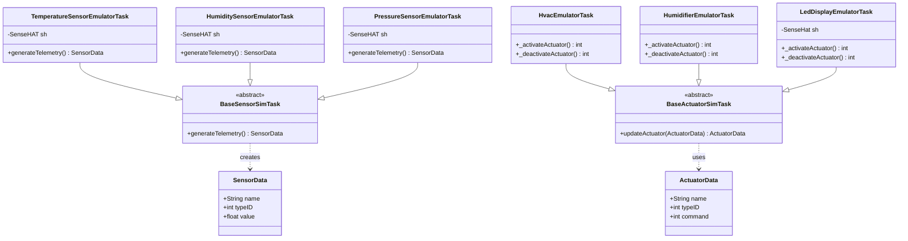

# CDA Lab Module 04 - Test Results

## Overview

Lab Module 04 implements data emulation using the Sense HAT Emulator for real-time sensor data collection and LED display control.

## Environment

- **Python:** 3.10.19 (venv-py310)
- **Emulator:** Sense HAT Emulator GUI
- **Date:** October 12, 2025

## Test Results

| Test | Status | Duration | Values |
|------|--------|----------|--------|
| Temperature Emulator | PASSED | 10.25s | 29.98-35.03°C |
| Humidity Emulator | PASSED | 10.02s | 45.10-45.51% |
| Pressure Emulator | PASSED | 10.02s | 983.60-983.61 mbar |
| HVAC Emulator | PASSED | 5.01s | 20°C, 22°C |
| Humidifier Emulator | PASSED | 5.01s | 35%, 50% |
| LED Display Emulator | PASSED | 65s | Scrolling text |

**Success Rate:** 100% (6/6 tests passed)

## Class Diagram



## Sample Outputs

**Temperature Sensor:**
```
TEMPERATURE READ FROM EMULATOR: 34.96875°C
TEMPERATURE READ FROM EMULATOR: 35.03125°C
```

**Humidity Sensor:**
```
SensorData: 45.507812 - name=HumiditySensor,typeID=1010
SensorData: 45.292969 - name=HumiditySensor,typeID=1010
```

**Pressure Sensor:**
```
SensorData: 983.599609 - name=PressureSensor,typeID=1012
SensorData: 983.607422 - name=PressureSensor,typeID=1012
```

**LED Display:**
```
LED MESSAGE: Hello, world!
LED MESSAGE: Welcome to Connected Devices!
LED DISPLAY CLEARED
```

## Implementation

**Sensor Reading:**
```python
self.sh = SenseHAT(emulate=True)
sensorVal = self.sh.environ.temperature  # or humidity, pressure
```

**LED Control:**
```python
from sense_emu import SenseHat
self.sh.show_message(msg, scroll_speed=0.05, text_colour=[255, 0, 0])
self.sh.clear()
```

## Setup

**Create Python 3.10 environment:**
```bash
python3.10 -m venv venv-py310
source venv-py310/bin/activate
pip install -r requirements.txt
```

**Install system dependencies:**
```bash
sudo apt install libgirepository1.0-dev gcc libcairo2-dev pkg-config
```

**Run emulator:**
```bash
sense_emu_gui &
```

## Running Tests

```bash
source venv-py310/bin/activate
python -m pytest tests/integration/emulated/test_*EmulatorTask.py -v
```

## References

- Lab Module 04: PIOT-CDA-04-001 through PIOT-CDA-04-005
- Repository: github.com/donald4u/cda-python-components

## Author

Donald - October 2025
