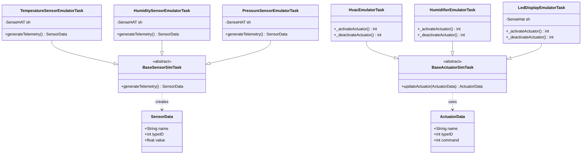

# CDA Lab Module 04 - Test Results

## Overview

Lab Module 04 connects your Python code to the Sense HAT Emulator GUI by creating sensor tasks that read live temperature, humidity, and pressure values directly from the emulator's sliders using SenseHAT(emulate=True).environ properties, and actuator tasks that control the 8x8 LED display using show_message() and clear() methods. Unlike Lab 03's pre-generated data, Lab 04 reads real-time values from an interactive virtual hardware interface, enabling you to adjust sensor values with GUI sliders and see LED responses instantly.

Lab Module 04 implements data emulation using the Sense HAT Emulator, enabling real-time sensor data collection and LED display control through a virtual hardware interface.
## Code Repository and Branch
- https://github.com/donald4u/cda-python-components/tree/labmodule04

## Environment

- **Python:** 3.10.19 (venv-py310)
- **Emulator:** Sense HAT Emulator GUI
- **Date:** October 12, 2025

## Test Results

| Test | Status | Duration | Values |
|------|--------|----------|--------|
| Temperature Emulator | PASSED | 10.25s | 29.98-35.03°C |
| Humidity Emulator | PASSED | 10.02s | 45.10-45.51% |
| Pressure Emulator | PASSED | 10.02s | 983.60-983.61 mbar |
| HVAC Emulator | PASSED | 5.01s | 20°C, 22°C |
| Humidifier Emulator | PASSED | 5.01s | 35%, 50% |
| LED Display Emulator | PASSED | 65s | Scrolling text |

**Success Rate:** 100% (6/6 tests passed)

## Class Diagram

## All Tests

Sensor Emulator Tests:
- test_TemperatureEmulatorTask.py - PASSED (10.25s) - Read 29.98-35.03°C
- test_HumidityEmulatorTask.py - PASSED (10.02s) - Read 45.10-45.51%
- test_PressureEmulatorTask.py - PASSED (10.02s) - Read 983.60-983.61 mbar

Actuator Emulator Tests:
- test_HvacEmulatorTask.py - PASSED (5.01s) - Commands at 20°C, 22°C
- test_HumidifierEmulatorTask.py - PASSED (5.01s) - Commands at 35%, 50%
- test_LedDisplayEmulatorTask.py - PASSED (65s) - Scrolling text display
Total: 6 tests, all passed, ~105 seconds total runtime
Key Achievement: Successfully integrated with Sense HAT Emulator GUI, reading live sensor data and controlling LED display.

