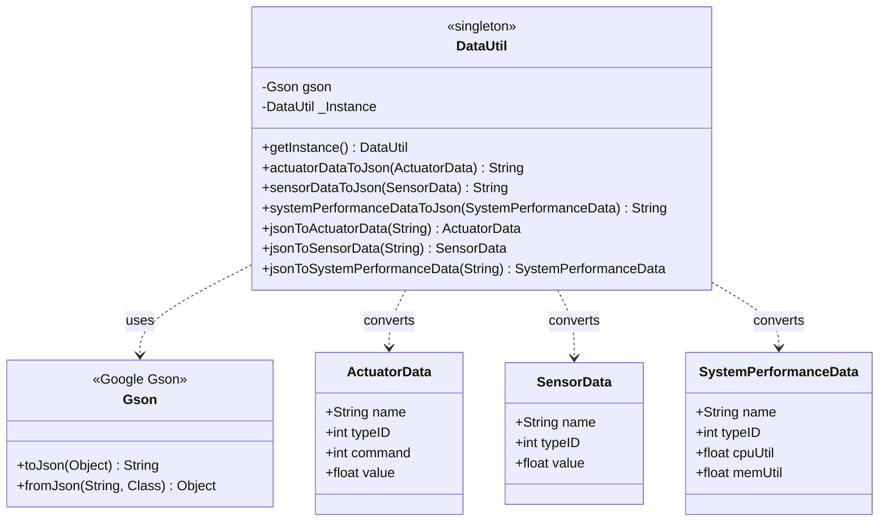

# GDA Lab Module 05 - Test Results

## Overview

Lab Module 05 implements JSON-based data serialization and deserialization for the GDA using Google's Gson library, enabling conversion of Java IoT data objects to/from JSON format.

## How It Works

The DataUtil singleton class uses Google's Gson library to serialize Java objects (SensorData, ActuatorData, SystemPerformanceData) to formatted JSON strings via `gson.toJson()` and deserialize JSON back to Java objects via `gson.fromJson()`. This enables the GDA to exchange data with the Python-based CDA and other systems using a common JSON format that both languages understand.

## Code Repository and Branch
- https://github.com/donald4u/gda-java-components/tree/labmodule05

## Environment

- **Java:** 17.0.16
- **Gson:** 2.8.9
- **Build Tool:** Maven 3.8.7
- **IDE:** Eclipse
- **Date:** October 19, 2025

## Class Diagram


## Running Tests

### Maven Command Line
```bash
cd ~/piot/gda-java-components
mvn test -Dtest=DataUtilTest
```

### Eclipse
1. Expand `src/test/java/programmingtheiot/unit/data/`
2. Right-click `DataUtilTest.java`
3. Run As → JUnit Test
4. Check JUnit tab for green bar

## Design Patterns

- **Singleton:** Single DataUtil instance accessed via getInstance()
- **Null Object Pattern:** Methods return null for invalid input
- **Pretty Printing:** Gson configured for human-readable JSON output

## References

- Lab Module 05: PIOT-GDA-05-001, PIOT-GDA-05-002
- Programming the Internet of Things by Andrew D. King (Chapter 5)
- Repository: github.com/donald4u/gda-java-components
- Gson Documentation: https://github.com/google/gson

## Author

Donald - October 2025
