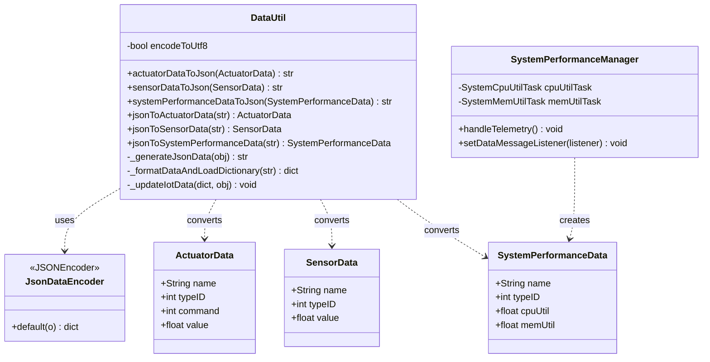

# CDA Lab Module 05 - Test Results

## Overview

Lab Module 05 implements JSON-based data serialization and deserialization for the CDA, enabling conversion of IoT data objects to/from JSON format.

## How It Works

The DataUtil class converts Python objects (SensorData, ActuatorData, SystemPerformanceData) to JSON text using the built-in json module and a custom JsonDataEncoder, then reconstructs objects from JSON by parsing the text and mapping fields to object attributes using setattr. This enables the CDA to serialize data for transmission to the GDA and other systems that require JSON format.

## Code Repository and Branch
- https://github.com/donald4u/gda-java-components/tree/labmodule05

## Environment

- **Python:** 3.12.3
- **Libraries:** json (built-in), decimal
- **Testing:** pytest
- **Date:** October 19, 2025

## Class Diagram



## Running Tests

```bash
cd ~/piot/cda-python-components
source venv/bin/activate
python -m pytest tests/unit/data/test_DataUtil.py -v
```

### In Eclipse
1. Expand `tests/unit/data/`
2. Right-click `test_DataUtil.py`
3. Run As → Python unit-test
4. Check Console for results

## Design Patterns

- **Singleton:** DataUtil uses single instance pattern
- **Template Method:** Helper methods abstract common conversion logic
- **Encoder Pattern:** JsonDataEncoder customizes JSON serialization

## References

- Lab Module 05: PIOT-CDA-05-001, PIOT-CDA-05-002
- Programming the Internet of Things by Andrew D. King (Chapter 5)
- Repository: github.com/donald4u/cda-python-components

## Author

Donald - October 2025
