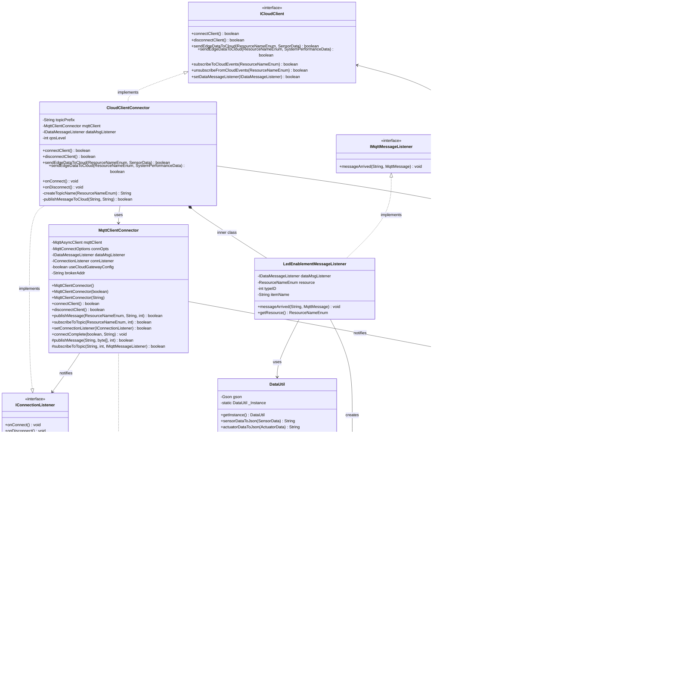

# Lab Module 11: Cloud Integration (Ubidots MQTT)

## Overview

Lab Module 11 implements cloud connectivity between the Gateway Device Application (GDA) and Ubidots cloud service using MQTT with TLS encryption. This module enables:

- Secure MQTT connection to Ubidots cloud broker
- Publishing sensor and system performance data to the cloud
- Receiving LED actuation commands from the cloud
- End-to-end data flow: CDA → GDA → Cloud → GDA → CDA

## Code Repository Branch
- https://github.com/donaldirebo/gda-java-components/tree/labmodule11


## Architecture and Class Diagram


## Tests Performed

### Exercise 1: Cloud Service Setup

**Objective:** Configure Ubidots STEM account and credentials

**Steps Performed:**
```bash
# Created credentials directory
mkdir -p ~/connecteddevices/cred
mkdir -p ~/connecteddevices/cert

# Created credentials file
nano ~/connecteddevices/cred/UbidotsCloudCred.props
# Content: userToken = BBUS-xxxxx

# Downloaded TLS certificate
curl -o ~/connecteddevices/cert/UbidotsCloudCert.pem https://cacerts.digicert.com/DigiCertGlobalRootCA.crt.pem

# Verified certificate
head ~/connecteddevices/cert/UbidotsCloudCert.pem
```

**Verification:**
```bash
echo "=== Credentials File ===" && cat ~/connecteddevices/cred/UbidotsCloudCred.props && echo "" && echo "=== Certificate File ===" && head -3 ~/connecteddevices/cert/UbidotsCloudCert.pem
```

---

### Exercise 2: MqttClientConnector Updates

**Objective:** Add cloud gateway configuration support to MqttClientConnector

**Test Command:**
```bash
cd ~/piot/gda-java-components && mvn test -Dtest=MqttClientConnectorTest
```

**Expected Output:**
```
Tests run: 2, Failures: 0, Errors: 0, Skipped: 0
BUILD SUCCESS
```

**Key Log Messages:**
- `Using Cloud Gateway Config: false` (for local MQTT)
- `Successfully subscribed to topic with listener: PIOT/ConstrainedDevice/ActuatorResponse`
- `Received ActuatorData response: 12.3`

---

### Exercise 3: ICloudClient Interface & Data Converters

**Objective:** Create TimeAndValue JSON converters for cloud-compatible data format

**Test Command:**
```bash
cd ~/piot/gda-java-components && mvn test -Dtest=TimeAndValuePayloadDataTest
```

**Expected Output:**
```
Tests run: 3, Failures: 0, Errors: 0, Skipped: 0
BUILD SUCCESS
```

---

### Exercise 4: CloudClientConnector Implementation

**Objective:** Implement cloud client with Ubidots MQTT integration

**Pre-requisite:** Enable cloud client in config
```bash
sed -i 's/enableCloudClient       = False/enableCloudClient       = True/' ~/piot/gda-java-components/config/PiotConfig.props
```

**Test Command:**
```bash
cd ~/piot/gda-java-components && mvn test -Dtest=CloudClientConnectorTest
```

**Expected Output:**
```
Tests run: 1, Failures: 0, Errors: 0, Skipped: 0
BUILD SUCCESS
```

**Key Log Messages:**
- `CloudClientConnector initialized with topic prefix: /v1.6/devices/`
- `Configuring TLS...`
- `PEM file valid. Using secure connection`
- `Successfully imported X.509 certificate`
- `TLS enabled`
- `Credentials now set`
- `MQTT Broker Address: ssl://industrial.api.ubidots.com:8883`
- `Using Cloud Gateway Config: true`
- `Setting connection listener`
- `Successfully connected cloud client to CSP`

---

### Exercise 5: End-to-End Cloud Integration

**Objective:** Complete cloud integration with LED actuation support

**Test Command:**
```bash
cd ~/piot/gda-java-components && mvn test -Dtest=CloudClientConnectorTest
```

**Expected Output:**
```
Tests run: 1, Failures: 0, Errors: 0, Skipped: 0
BUILD SUCCESS
```

**Key Log Messages:**
- `Successfully connected cloud client to CSP`
- `Successfully connected MQTT client to broker`
- `Handling CSP subscriptions and device topic provisioning...`
- `Subscribed to LED actuation topic`

---
