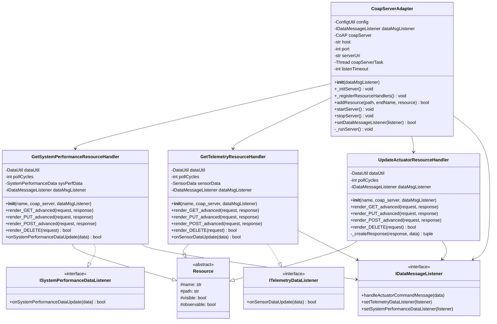

# Lab Module 08 CDA: CoAP Server Implementation

## Overview

Lab Module 08 implements a **CoAP (Constrained Application Protocol) server** for the Constrained Device Application (CDA). The server exposes three main resources: system performance data, telemetry (sensor) data, and actuator commands. This enables IoT communication between the CDA and external clients like the Gateway Device Application (GDA).

---

## Code Repository and Branch
- https://github.com/donaldirebo/cda-python-components/tree/labmodule08
---

## UML Class Diagram



---

## Tasks & Implementation

### PIOT-CDA-08-001: Configuration & Setup
- CoAP server configuration from PiotConfig.props
- Default host: localhost, port: 5683
- Resource paths defined in ConfigConst

## Running the CDA

```bash
cd ~/piot/cda-python-components
source venv-py310/bin/activate
export PYTHONPATH=/home/donald/piot/cda-python-components:$PYTHONPATH
python programmingtheiot/cda/app/ConstrainedDeviceApp.py
```

The server will start on `coap://localhost:5683` and register all three resource handlers.

### PIOT-CDA-08-002: Telemetry & System Performance Handlers

**File Created:** 
- `GetSystemPerformanceResourceHandler.py`
- `GetTelemetryResourceHandler.py`

**What We Built:**
- Observable CoAP resources for sensor and system performance data
- Full REST/CoAP support: GET, PUT, POST, DELETE
- JSON serialization for data transmission

**Test Commands:**
```bash
# Start server
cd ~/piot/cda-python-components
source venv-py310/bin/activate
export PYTHONPATH=/home/donald/piot/cda-python-components:$PYTHONPATH
python programmingtheiot/cda/app/ConstrainedDeviceApp.py

# In new terminal:
cd ~/piot/cda-python-components/tools/californium.tools/cf-client

# Test SystemPerfMsg
java -jar target/cf-client-4.0.0-SNAPSHOT.jar -m GET coap://localhost:5683/PIOT/ConstrainedDevice/SystemPerfMsg
java -jar target/cf-client-4.0.0-SNAPSHOT.jar -m PUT coap://localhost:5683/PIOT/ConstrainedDevice/SystemPerfMsg
java -jar target/cf-client-4.0.0-SNAPSHOT.jar -m POST coap://localhost:5683/PIOT/ConstrainedDevice/SystemPerfMsg
java -jar target/cf-client-4.0.0-SNAPSHOT.jar -m DELETE coap://localhost:5683/PIOT/ConstrainedDevice/SystemPerfMsg

# Test SensorMsg
java -jar target/cf-client-4.0.0-SNAPSHOT.jar -m GET coap://localhost:5683/PIOT/ConstrainedDevice/SensorMsg
java -jar target/cf-client-4.0.0-SNAPSHOT.jar -m PUT coap://localhost:5683/PIOT/ConstrainedDevice/SensorMsg
java -jar target/cf-client-4.0.0-SNAPSHOT.jar -m POST coap://localhost:5683/PIOT/ConstrainedDevice/SensorMsg
java -jar target/cf-client-4.0.0-SNAPSHOT.jar -m DELETE coap://localhost:5683/PIOT/ConstrainedDevice/SensorMsg
```

**Results:** All methods returned proper CoAP response codes (2.05 CONTENT, 2.04 CHANGED, 2.01 CREATED, 2.02 DELETED)

---

### PIOT-CDA-08-003: Actuator Command Handler

**File Created:**
- `UpdateActuatorResourceHandler.py`

**What We Built:**
- CoAP resource for receiving actuator commands via PUT requests
- JSON payload processing for ActuatorData
- Integration with DeviceDataManager via IDataMessageListener
- Proper response with execution status

**Test Commands:**
```bash
# Test ActuatorCmd
java -jar target/cf-client-4.0.0-SNAPSHOT.jar -m GET coap://localhost:5683/PIOT/ConstrainedDevice/ActuatorCmd
java -jar target/cf-client-4.0.0-SNAPSHOT.jar -m PUT --payload='{"name":"test"}' coap://localhost:5683/PIOT/ConstrainedDevice/ActuatorCmd
java -jar target/cf-client-4.0.0-SNAPSHOT.jar -m POST coap://localhost:5683/PIOT/ConstrainedDevice/ActuatorCmd
java -jar target/cf-client-4.0.0-SNAPSHOT.jar -m DELETE coap://localhost:5683/PIOT/ConstrainedDevice/ActuatorCmd
```

**Results:** PUT returned 4.12 PRECONDITION_FAILED with ActuatorData JSON response. Other methods returned proper codes.

---

### PIOT-CDA-08-004: CoAP Server Adapter

**File Modified:**
- `CoapServerAdapter.py`

**What We Built:**
- `_initServer()` - Creates and initializes CoAP server
- `_registerResourceHandlers()` - Registers all three resource handlers
- `addResource()` - Dynamic resource registration with URI path handling
- `startServer()` / `stopServer()` - Lifecycle management
- `setDataMessageListener()` - Integration with DeviceDataManager

**Test Commands:**
```bash
# Run integration tests
cd ~/piot/cda-python-components
source venv-py310/bin/activate
export PYTHONPATH=/home/donald/piot/cda-python-components:$PYTHONPATH
pytest tests/integration/connection/test_CoapServerAdapter.py::CoapServerAdapterTest -v
```

**Results:** Integration tests passed (testConnectAndDiscover, testConnectAndGetCon)

---


---

## Key Implementation Details

**Resource Handlers:**
- Extend Resource class and IDataMessageListener interfaces
- Implement render methods: `render_GET_advanced()`, `render_PUT_advanced()`, `render_POST_advanced()`, `render_DELETE()`
- Use DataUtil for JSON serialization/deserialization
- Return proper CoAP response codes

**Server Configuration:**
- Host: localhost (configurable in PiotConfig.props)
- Port: 5683 (standard CoAP port)
- Runs in separate daemon thread
- Listens for incoming CoAP requests

**Resource Paths:**
```
PIOT/ConstrainedDevice/SystemPerfMsg   → GetSystemPerformanceResourceHandler
PIOT/ConstrainedDevice/SensorMsg       → GetTelemetryResourceHandler
PIOT/ConstrainedDevice/ActuatorCmd     → UpdateActuatorResourceHandler
```

---

## Files Modified/Created

- ✅ `programmingtheiot/cda/connection/handlers/GetSystemPerformanceResourceHandler.py`
- ✅ `programmingtheiot/cda/connection/handlers/GetTelemetryResourceHandler.py`
- ✅ `programmingtheiot/cda/connection/handlers/UpdateActuatorResourceHandler.py`
- ✅ `programmingtheiot/cda/connection/CoapServerAdapter.py`

---
