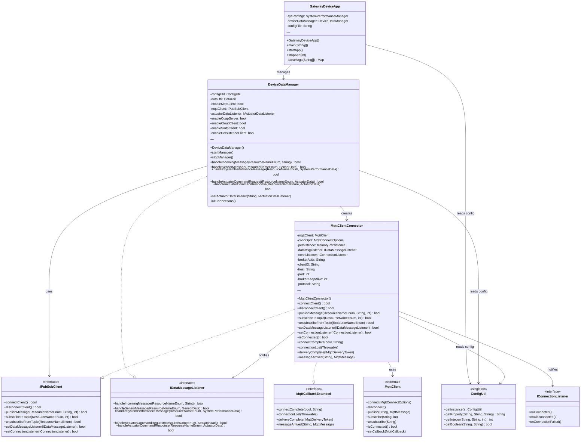

# Lab Module 07: MQTT Client Implementation for Gateway Device App

## Overview

Lab Module 07 focuses on implementing MQTT (Message Queuing Telemetry Transport) client functionality for the Gateway Device Application (GDA). MQTT is a lightweight publish-subscribe messaging protocol widely used in IoT applications for reliable communication between distributed devices and brokers.

## Objectives

- Implement an MQTT client connector using the Eclipse Paho MQTT library
- Understand publish-subscribe messaging patterns in IoT applications
- Implement callback methods for handling MQTT connection events and incoming messages
- Integrate MQTT connectivity into the Gateway Device Application
- Test MQTT communication between multiple clients and a broker
## Code Repository and Branch
- https://github.com/donaldirebo/gda-java-components/tree/labmodule07

## Test Completed

### Test 1: Connect and Disconnect
**Objective:** Establish and terminate MQTT broker connections with proper error handling

**Test Method:** `testConnectAndDisconnect()`
- First connection succeeds and returns true
- Attempt to connect again returns false (already connected)
- Disconnect succeeds and returns true
- Attempt to disconnect again returns false (already disconnected)

**Testing in Eclipse:**
1. Ensure MQTT broker is running: `mosquitto` in a terminal
2. Open Eclipse and navigate to `src/test/java/programmingtheiot/integration/connection/MqttClientConnectorTest.java`
3. Ensure only `testConnectAndDisconnect()` has `@Test` annotation (comment out other test methods)
4. Right-click on the test file → **Run As** → **JUnit Test**
5. Observe test execution in Eclipse Console:
   - Green bar indicates test passed
   - Check log output for connection/disconnection messages
   - Verify "already connected" and "not connected" warning messages appear
6. Test runtime: ~65 seconds (due to keep-alive timer)

**Key Learning:** Proper state management for connection handling

### Test 2: MQTT Callback Methods
**Objective:** Implement callback handlers for MQTT events

**Callback Methods Implemented:**
- `connectComplete()` - Fires when connection to broker is established
- `connectionLost()` - Fires when connection to broker is lost
- `deliveryComplete()` - Fires when message delivery is confirmed
- `messageArrived()` - Fires when a message arrives on a subscribed topic

**Testing in Eclipse:**
1. Open MqttClientConnector.java in Eclipse
2. Verify the four callback methods are implemented with appropriate logging:
   - `connectComplete()` should log: "Successfully connected to MQTT broker"
   - `deliveryComplete()` should log: "Delivered MQTT message with ID"
   - `messageArrived()` should log: "MQTT message arrived on topic"
   - `connectionLost()` should log: "Lost connection to MQTT broker"
3. Run `testConnectAndDisconnect()` again (from Exercise 1)
4. In Eclipse Console, observe:
   - INFO log from `connectComplete()` after successful connection
   - Callback methods are invoked at appropriate times during test lifecycle

**Key Learning:** Event-driven programming for real-time message handling

### Test 3: Publish and Subscribe
**Objective:** Send and receive messages through MQTT topics

**Test Method:** `testPublishAndSubscribe()`
- Subscribe to 4 CDA data topics (sensor, system performance, actuator response, management status)
- Publish 3 test messages to management status topic
- Verify message delivery confirmations
- Verify messages arrive on subscribed topics
- Unsubscribe from all 4 topics
- Validate successful disconnection

**Topics Tested:**
- PIOT/GatewayDevice/MgmtStatusMsg (gateway management)
- PIOT/ConstrainedDevice/ActuatorResponse (actuator data)
- PIOT/ConstrainedDevice/SensorMsg (sensor data)
- PIOT/ConstrainedDevice/SystemPerfMsg (system performance data)

**Testing in Eclipse:**
1. Ensure MQTT broker is running: `mosquitto`
2. Open `MqttClientConnectorTest.java` in Eclipse
3. Modify test annotations:
   - Add `@Test` annotation to `testPublishAndSubscribe()` method
   - Comment out `@Test` annotations on other test methods (use `//@Test`)
4. Right-click on the test file → **Run As** → **JUnit Test**
5. Monitor Eclipse Console during test execution (~95 seconds):
   - Observe subscription confirmation messages for each of 4 topics
   - Watch for delivery complete messages (3 published messages)
   - Verify message arrival logs for each published message on subscribed topic
   - Confirm unsubscription messages for each of 4 topics
   - Check final disconnection message
6. Test completion:
   - Green bar indicates all assertions passed
   - Verify no exceptions in console output

**Key Learning:** Full pub/sub lifecycle management

### Test 4: GDA Application Integration
**Objective:** Integrate MQTT into the full GDA application

**Test Approach:**
1. Build GDA as executable JAR: `mvn clean package -DskipTests -Dmaven.test.skip=true`
2. Start GDA application: `java -jar target/gateway-device-app-0.0.1-jar-with-dependencies.jar`
3. GDA automatically:
   - Initializes MQTT client connector
   - Connects to MQTT broker
   - Subscribes to 3 CDA data topics
   - Waits to receive published messages
4. Run separate test client in Eclipse that publishes test messages
5. Verify GDA receives and logs all messages

**Key Learning:** Integration of individual components into complete application
