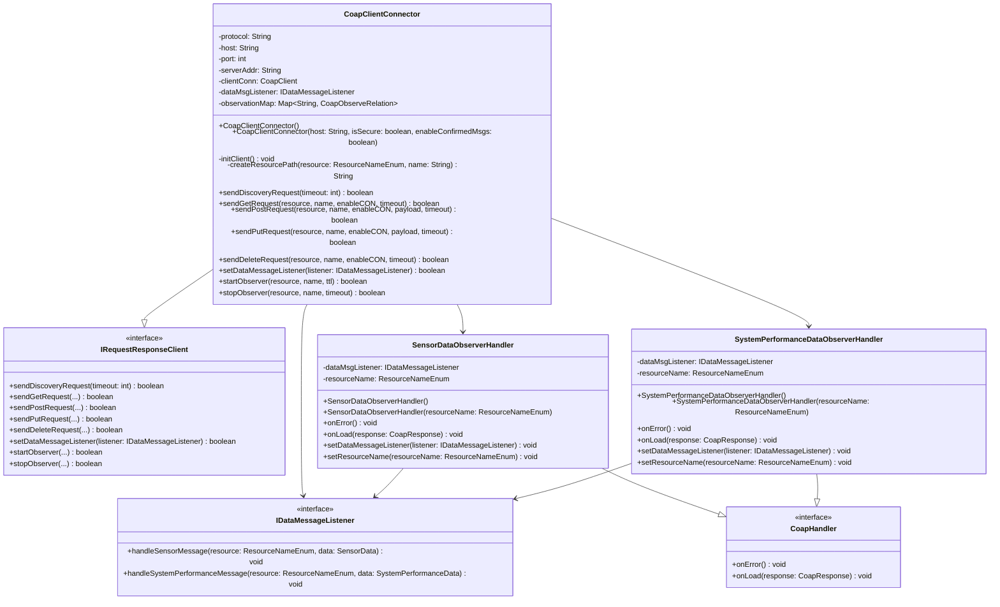

# Lab Module 09: CoAP Client Implementation for Gateway Device Application (GDA)

## Overview

This lab module implements a comprehensive CoAP (Constrained Application Protocol) client for the Gateway Device Application (GDA) using the Eclipse Californium library. The implementation provides full request/response communication capabilities between the GDA and CDA (Constrained Device Application), supporting synchronous requests and asynchronous observation patterns.

---

## Code Repository Branch
- https://github.com/donaldirebo/gda-java-components/tree/labmodule09
---

## Architecture and Class Diagram



---


## Lab Modules Breakdown

### PIOT-GDA-09-001: CoAP Client Configuration and Initialization

**Objective:** Set up the foundational CoAP client infrastructure

```
```
**How It Was Tested - Eclipse:**

1. Open Project Explorer in Eclipse
2. Navigate to: `src/test/java/programmingtheiot/integration/connection/CoapClientConnectorTest.java`
3. Right-click on the file
4. Select: **Run As** → **JUnit Test**
5. The `@Before` setup method runs before each test
6. CoapClientConnector is instantiated and initialized
7. Verify in Eclipse console that no initialization errors appear

**How It Was Tested - Terminal:**

```bash
cd ~/piot/gda-java-components
mvn test -Dtest=CoapClientConnectorTest#testConnectAndDiscover
```
---

### PIOT-GDA-09-002: Framework Integration and Data Listener Setup

**Objective:** Integrate CoAP client with GDA framework and establish data callback mechanisms

```

```
**How It Was Tested - Eclipse:**

1. Right-click `CoapClientConnectorTest.java`
2. Select: **Run As** → **JUnit Test**
3. All 11 tests execute the `@Before` setup method
4. DefaultDataMessageListener is created
5. Listener is registered via `setDataMessageListener()`
6. Listener is accessible for callbacks throughout all tests
7. Verify no exceptions during listener setup

**How It Was Tested - Terminal:**

```bash
cd ~/piot/gda-java-components
mvn test -Dtest=CoapClientConnectorTest
```

---

### PIOT-GDA-09-003: CoAP Discovery

**Objective:** Implement resource discovery mechanism to identify available CoAP resources


```
```
**How It Was Tested - Eclipse:**

1. Start GDA server in separate terminal:
   ```bash
   cd ~/piot/gda-java-components
   java -jar target/gateway-device-app-0.0.1-jar-with-dependencies.jar
   ```

2. In Eclipse, right-click `CoapClientConnectorTest.java`

3. Select: **Run As** → **JUnit Test**

4. JUnit panel shows test execution

5. Look for test: `testConnectAndDiscover` with execution time

6. Switch to Console tab to view test output

**How It Was Tested - Terminal:**

```bash
# Terminal 1 - Start GDA server
cd ~/piot/gda-java-components
java -jar target/gateway-device-app-0.0.1-jar-with-dependencies.jar

# Terminal 2 - Run discovery test
cd ~/piot/gda-java-components
mvn test -Dtest=CoapClientConnectorTest#testConnectAndDiscover
```
```

---
### PIOT-GDA-09-004: CoAP GET Requests

**Objective:** Implement synchronous GET request functionality for resource retrieval
```

```

**How It Was Tested - Eclipse:**

1. Right-click `CoapClientConnectorTest.java`
2. Select: **Run As** → **JUnit Test**
3. In JUnit panel, locate tests:
   - `testGetRequestCon` (0.015 s)
   - `testGetRequestNon` (0.007 s)
4. Both should show green checkmarks
5. Switch to Console tab to see output

**How It Was Tested - Terminal:**

```bash
cd ~/piot/gda-java-components
mvn test -Dtest=CoapClientConnectorTest#testGetRequestCon
mvn test -Dtest=CoapClientConnectorTest#testGetRequestNon
```

---

### PIOT-GDA-09-005: CoAP PUT Requests with Wireshark Monitoring

**Objective:** Implement synchronous PUT request functionality for resource updates and verify packet-level communication


**How It Was Tested - Eclipse (Without Wireshark):**

1. Right-click `CoapClientConnectorTest.java`
2. Select: **Run As** → **JUnit Test**
3. In JUnit panel, locate tests:
   - `testPutRequestCon` (0.017 s)
   - `testPutRequestNon` (0.011 s)
4. Both should show green checkmarks

**How It Was Tested - Eclipse (With Wireshark Monitoring):**

**Step 1: Install and Start Wireshark on Ubuntu**

```bash
# Install Wireshark (if not already installed)
sudo apt update
sudo apt install wireshark

# Start Wireshark
sudo wireshark &
```

**Step 2: Configure Wireshark for CoAP Capture**

1. In Wireshark GUI window:
   - Look at the list of available interfaces at startup
   - Select the **lo** (loopback) interface
   - Double-click it to start capturing
   - OR click the blue shark fin icon to start capture

2. Apply CoAP filter:
   - Find the filter bar at the top
   - Type: `coap`
   - Press Enter

3. Wireshark is now capturing only CoAP packets on loopback

**Step 3: Start GDA Server**

```bash
cd ~/piot/gda-java-components
java -jar target/gateway-device-app-0.0.1-jar-with-dependencies.jar
```

Wait for:
```
INFO: GDA started successfully.
INFO: CoAP server started successfully.
```

**Step 4: Run PUT Request Tests**

1. In Eclipse, right-click `CoapClientConnectorTest.java`
2. Select: **Run As** → **JUnit Test**
3. Watch Wireshark capture window in real-time
4. You will see CoAP packets appearing as tests run

**Step 5: Analyze Packets in Wireshark**

For **Confirmed Messaging (CON):**
- Look for packets labeled with "PUT" method
- Observe Type: "Confirmable (0)"
- See CoAP message ID and token
- Notice ACK responses from server

For **Non-Confirmed Messaging (NON):**
- Look for packets labeled with "PUT" method
- Observe Type: "Non-Confirmable (1)"
- No ACK responses expected
- Faster transmission

**Wireshark Packet Details to Observe:**

```
Frame X: YYY bytes
CoAP
    Version: 1
    Type: Confirmable (0) or Non-Confirmable (1)
    Token Length: 0-8
    Code: 0.03 (PUT)
    Message ID: XXXX
    Options:
        Uri-Path: PIOT
        Uri-Path: GatewayDevice
        Uri-Path: MgmtStatusMsg
    Payload: {"command":2}
```

**How It Was Tested - Terminal (Without Wireshark):**

```bash
# Terminal 1 - Start GDA server
cd ~/piot/gda-java-components
java -jar target/gateway-device-app-0.0.1-jar-with-dependencies.jar

# Terminal 2 - Run PUT tests
cd ~/piot/gda-java-components
mvn test -Dtest=CoapClientConnectorTest#testPutRequestCon
mvn test -Dtest=CoapClientConnectorTest#testPutRequestNon
```

**How It Was Tested - Terminal (With Wireshark Monitoring):**

```bash
# Terminal 1 - Start Wireshark capture
sudo wireshark &

# In Wireshark GUI:
# - Select lo (loopback) interface
# - Click blue shark fin to start capturing
# - Add filter: coap
# - Press Enter

# Terminal 2 - Start GDA server
cd ~/piot/gda-java-components
java -jar target/gateway-device-app-0.0.1-jar-with-dependencies.jar

# Terminal 3 - Run PUT tests
cd ~/piot/gda-java-components
mvn test -Dtest=CoapClientConnectorTest#testPutRequestCon
mvn test -Dtest=CoapClientConnectorTest#testPutRequestNon

# In Wireshark, you will see:
# - PUT request packets (CON or NON)
# - Corresponding acknowledgments or responses
# - Complete packet details and payload
```

### PIOT-GDA-09-006: CoAP POST Requests

**Objective:** Implement synchronous POST request functionality for resource creation


```

**How It Was Tested - Eclipse:**

1. Right-click `CoapClientConnectorTest.java`
2. Select: **Run As** → **JUnit Test**
3. In JUnit panel, locate tests:
   - `testPostRequestCon` (0.032 s)
   - `testPostRequestNon` (0.011 s)
4. Both should show green checkmarks

**How It Was Tested - Terminal:**

```bash
cd ~/piot/gda-java-components
mvn test -Dtest=CoapClientConnectorTest#testPostRequestCon
mvn test -Dtest=CoapClientConnectorTest#testPostRequestNon
```

---

### PIOT-GDA-09-007: CoAP DELETE Requests

**Objective:** Implement synchronous DELETE request functionality for resource removal


```

**How It Was Tested - Eclipse:**

1. Right-click `CoapClientConnectorTest.java`
2. Select: **Run As** → **JUnit Test**
3. In JUnit panel, locate tests:
   - `testDeleteRequestCon` (0.008 s)
   - `testDeleteRequestNon` (0.011 s)
4. Both should show green checkmarks

**How It Was Tested - Terminal:**

```bash
cd ~/piot/gda-java-components
mvn test -Dtest=CoapClientConnectorTest#testDeleteRequestCon
mvn test -Dtest=CoapClientConnectorTest#testDeleteRequestNon
```

---

### PIOT-GDA-09-008: CoAP OBSERVE Functionality

**Objective:** Implement asynchronous resource observation for real-time data updates


**How It Was Tested - Eclipse:**

1. Ensure GDA server is running with CoAP server enabled
2. Right-click `CoapClientConnectorTest.java`
3. Select: **Run As** → **JUnit Test**
4. All 11 tests execute
5. In JUnit panel, locate OBSERVE tests:
   - `testObserveSensorData` (10.50 s)
   - `testObserveSystemPerformanceData` (10.010 s)
6. Both should show green checkmarks
7. In Console tab, observe output showing observations received

**How It Was Tested - Terminal:**

```bash
# Terminal 1 - Start GDA server
cd ~/piot/gda-java-components
java -jar target/gateway-device-app-0.0.1-jar-with-dependencies.jar

# Terminal 2 - Run only OBSERVE tests
cd ~/piot/gda-java-components
mvn test -Dtest=CoapClientConnectorTest#testObserveSensorData
mvn test -Dtest=CoapClientConnectorTest#testObserveSystemPerformanceData

# Or run all tests (including OBSERVE)
mvn test -Dtest=CoapClientConnectorTest
```


---
