# PIOT-CDA Lab Module 10: Edge Integration

## Overview

Lab Module 10 implements **bidirectional communication** between the Constrained Device Application (CDA) and Gateway Device Application (GDA) using MQTT and CoAP protocols. This module completes the IoT system integration, enabling the CDA to send sensor and system performance data upstream to the GDA, while receiving actuator commands from the GDA and executing them locally.

---


## Code Repository Branch
- https://github.com/donaldirebo/cda-python-components/tree/labmodule10
---

## Architecture and Class Diagram

```mermaid
classDiagram
    class IDataMessageListener {
        <<interface>>
        +handleActuatorCommandMessage(data: ActuatorData)*
        +handleSensorMessage(data: SensorData)*
        +handleSystemPerformanceMessage(data: SystemPerformanceData)*
        +handleActuatorCommandResponse(data: ActuatorData)*
        +handleIncomingMessage(resource: ResourceNameEnum, msg: str)*
    }

    class DeviceDataManager {
        -mqttClient: MqttClientConnector
        -sensorAdapterMgr: SensorAdapterManager
        -sysPerfMgr: SystemPerformanceManager
        -actuatorAdapterMgr: ActuatorAdapterManager
        -enableMqttClient: bool
        -handleTempChangeOnDevice: bool
        -triggerHvacTempFloor: float
        -triggerHvacTempCeiling: float
        +__init__()
        +startManager()
        +stopManager()
        +handleActuatorCommandMessage(data: ActuatorData)
        +handleSensorMessage(data: SensorData): bool
        +handleSystemPerformanceMessage(data: SystemPerformanceData): bool
        -_handleSensorDataAnalysis(data: SensorData)
        -_handleUpstreamTransmission(resourceName: ResourceNameEnum, msg: str)
    }

    class MqttClientConnector {
        -mqttClient: paho.mqtt.Client
        -dataMsgListener: IDataMessageListener
        -clientID: str
        -host: str
        -port: int
        -keepAlive: int
        -defaultQos: int
        +__init__(clientID: str)
        +connectClient(): bool
        +disconnectClient(): bool
        +publishMessage(resource: ResourceNameEnum, msg: str, qos: int): bool
        +subscribeToTopic(resource: ResourceNameEnum, qos: int): bool
        +setDataMessageListener(listener: IDataMessageListener)
        +onConnect(client, userdata, flags, rc)
        +onActuatorCommandMessage(client, userdata, msg)
        +onDisconnect(client, userdata, rc)
        +onPublish(client, userdata, mid)
        +onSubscribe(client, userdata, mid, granted_qos)
        +onMessage(client, userdata, msg)
    }

    class SensorAdapterManager {
        -scheduler: BackgroundScheduler
        -humidityAdapter: HumiditySensorSimTask
        -pressureAdapter: PressureSensorSimTask
        -tempAdapter: TemperatureSensorSimTask
        -dataMsgListener: IDataMessageListener
        -useEmulator: bool
        -pollRate: int
        +__init__()
        +startManager(): bool
        +stopManager(): bool
        +handleTelemetry()
        +setDataMessageListener(listener: IDataMessageListener): bool
        -_initEnvironmentalSensorTasks()
    }

    class SystemPerformanceManager {
        -scheduler: BackgroundScheduler
        -dataMsgListener: IDataMessageListener
        -pollRate: int
        +__init__()
        +startManager(): bool
        +stopManager(): bool
        +handleTelemetry()
        +setDataMessageListener(listener: IDataMessageListener): bool
    }

    class ActuatorAdapterManager {
        -dataMsgListener: IDataMessageListener
        -useEmulator: bool
        +__init__(dataMsgListener: IDataMessageListener)
        +sendActuatorCommand(data: ActuatorData): ActuatorData
        +setDataMessageListener(listener: IDataMessageListener): bool
    }

    class ActuatorData {
        -name: str
        -typeID: int
        -timeStamp: datetime
        -statusCode: int
        -hasError: bool
        -command: int
        -value: float
        -stateData: str
        -isResponse: bool
        +__init__(typeID: int)
        +setCommand(command: int)
        +setValue(value: float)
        +setLocationID(locationID: str)
        +getName(): str
        +getCommand(): int
        +getValue(): float
    }

    class SensorData {
        -name: str
        -typeID: int
        -timeStamp: datetime
        -statusCode: int
        -hasError: bool
        -value: float
        -locationID: str
        +__init__(typeID: int)
        +setValue(value: float)
        +setLocationID(locationID: str)
        +getName(): str
        +getValue(): float
        +getTypeID(): int
    }

    class SystemPerformanceData {
        -name: str
        -typeID: int
        -timeStamp: datetime
        -statusCode: int
        -cpuUtilization: float
        -memoryUtilization: float
        +__init__()
        +setName(name: str)
        +setLocationID(locationID: str)
        +getName(): str
    }

    class DataUtil {
        +actuatorDataToJson(data: ActuatorData): str
        +jsonToActuatorData(jsonData: str): ActuatorData
        +sensorDataToJson(data: SensorData): str
        +jsonToSensorData(jsonData: str): SensorData
        +systemPerformanceDataToJson(data: SystemPerformanceData): str
        +jsonToSystemPerformanceData(jsonData: str): SystemPerformanceData
    }

    class ResourceNameEnum {
        <<enum>>
        CDA_ACTUATOR_CMD_RESOURCE
        CDA_SENSOR_MSG_RESOURCE
        CDA_SYSTEM_PERF_MSG_RESOURCE
        CDA_MGMT_STATUS_MSG_RESOURCE
        CDA_MGMT_STATUS_CMD_RESOURCE
    }

    class DefaultDataMessageListener {
        +handleActuatorCommandMessage(data: ActuatorData)
        +handleSensorMessage(data: SensorData)
        +handleSystemPerformanceMessage(data: SystemPerformanceData)
        +handleActuatorCommandResponse(data: ActuatorData)
        +handleIncomingMessage(resource: ResourceNameEnum, msg: str)
    }

    %% Relationships
    DeviceDataManager --|> IDataMessageListener: implements
    DeviceDataManager *-- MqttClientConnector: uses
    DeviceDataManager *-- SensorAdapterManager: uses
    DeviceDataManager *-- SystemPerformanceManager: uses
    DeviceDataManager *-- ActuatorAdapterManager: uses
    
    MqttClientConnector --> IDataMessageListener: calls back
    SensorAdapterManager --> IDataMessageListener: calls back
    SystemPerformanceManager --> IDataMessageListener: calls back
    ActuatorAdapterManager --> IDataMessageListener: calls back
    
    DeviceDataManager --> ActuatorData: creates/processes
    DeviceDataManager --> SensorData: processes
    DeviceDataManager --> SystemPerformanceData: processes
    
    MqttClientConnector --> DataUtil: uses
    DeviceDataManager --> DataUtil: uses
    
    MqttClientConnector --> ResourceNameEnum: uses topics
    DeviceDataManager --> ResourceNameEnum: uses topics
    
    DefaultDataMessageListener --|> IDataMessageListener: implements
    
    %% Lab 10 Module Annotations
    note "PIOT-CDA-10-001: TLS Support\nMqttClientConnector with TLS config"
    note "PIOT-CDA-10-002: Actuator Commands\nhandleActuatorCommandMessage()"
    note "PIOT-CDA-10-003: Subscription\nonActuatorCommandMessage() callback"
    note "PIOT-CDA-10-004: Upstream Transmission\n_handleUpstreamTransmission()\nhandleSensorMessage()\nhandleSystemPerformanceMessage()"
```

**Test Approach:**
```bash
# Terminal 1: Start Mosquitto with TLS
mosquitto -c /etc/mosquitto/mosquitto.conf

# Eclipse: Run test_MqttClientConnector.py
# Verify TLS handshake and encrypted connection establishment
```

---

### PIOT-CDA-10-002: Actuator Command Message Handling
**Objective:** Process incoming actuator command messages from the GDA and route them to the actuation system.

**Test Approach:**
```bash
# Eclipse: Run test_MqttClientConnector.py
# Watch console for:
# - "[Callback] Subscribed MID: 1"
# - "[Callback] Actuator command message received"
# - JSON decoding confirmation
```

---

### PIOT-CDA-10-003: Actuator Command Message Subscription
**Objective:** Subscribe to actuator command topic and automatically handle incoming messages.

**Test Approach (Eclipse):**
```
1. Right-click tests/integration/connection/test_MqttClientConnector.py
2. Select "Run As → Python unit-test"
3. Select testNewActuatorCmdPubSub (other tests skipped with @unittest.skip)
4. Watch console output for:
   - Connection established
   - Subscription confirmed (MID: 1)
   - Message received after 5-second delay
   - Clean disconnection
5. Expected runtime: ~70 seconds
```

---

### PIOT-CDA-10-004: Upstream Transmission of Sensor and System Performance Data
**Objective:** Send sensor data and system performance data to the GDA via MQTT.

**Test Approach (Eclipse - Most Important):**
```
1. Open config/PiotConfig.props
   - Verify: enableSensing = True
   - Verify: enableEmulator = True
   - Verify: enableSystemPerformance = True

2. In Eclipse, right-click: tests/integration/app/test_DeviceDataManagerIntegration.py
   Select: "Run As → Python unit-test"

3. Watch console output (60-second test):
   ✓ DeviceDataManager created
   ✓ MQTT client connected to localhost:1883
   ✓ CoAP server started
   ✓ SystemPerformanceManager started
   ✓ SensorAdapterManager started
   ✓ Every 5 seconds:
     - Sensor data published to MQTT (humidity, pressure, temperature)
     - System performance data published to MQTT
     - Threshold analysis triggered (temp crossing floor/ceiling)
     - Actuator commands generated if thresholds crossed

4. Console should show repeating pattern:
   ```
   Incoming sensor data received (from sensor manager)
   Upstream transmission invoked. Checking communications integration.
   Published incoming data to resource (MQTT): ResourceNameEnum.CDA_SENSOR_MSG_RESOURCE
   Incoming system performance message received (from sys perf manager)
   Published incoming data to resource (MQTT): ResourceNameEnum.CDA_SYSTEM_PERF_MSG_RESOURCE
   ```

5. Test concludes with clean shutdown:
   - Unsubscribe from all topics
   - Disconnect MQTT client
   - Stop CoAP server
   - Stop all managers
```

