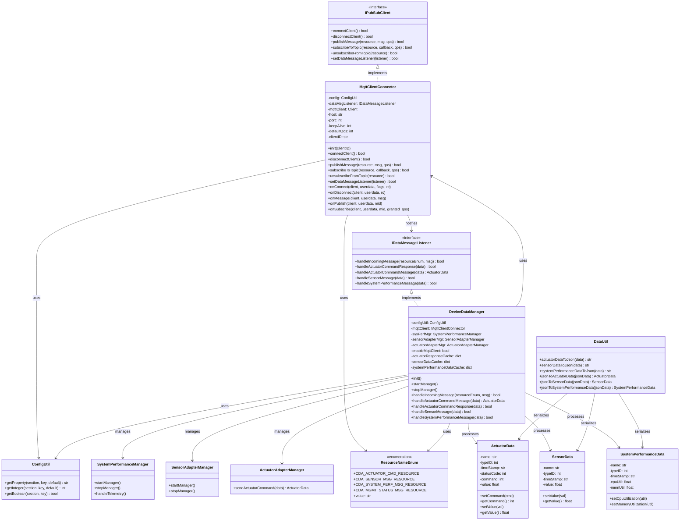

# Lab Module 06 - MQTT Client Implementation for CDA

## Overview

Lab Module 06 focuses on building robust publish/subscribe (pub/sub) data communications capability into the Constrained Device Application (CDA) using MQTT (Message Queuing Telemetry Transport) protocol. This module implements an MQTT client abstraction layer that enables the CDA to publish messages to an MQTT broker and receive updates through topic-level subscriptions.

---

## Objectives

- Implement a complete MQTT client connector for the CDA
- Enable bidirectional communication between CDA and MQTT broker
- Integrate MQTT functionality into the DeviceDataManager
- Validate pub/sub messaging with comprehensive integration tests
- Prepare for future CDA-GDA communication via MQTT

---
## Code Repository and Branch
- https://github.com/donaldirebo/cda-python-components/tree/labmodule06
---
## Class Diagram

## Tests Performed

### Test 1: PIOT-CDA-06-001 - Basic Connection and Disconnection

**Test:** `testConnectAndDisconnect()`

**Purpose:** Verify basic MQTT client connectivity

**How to Run:**
```bash
# Enable only testConnectAndDisconnect in test file
cd ~/piot/cda-python-components
source venv/bin/activate
export PYTHONPATH=$(pwd)
python3 -m unittest tests.integration.connection.test_MqttClientConnector -v
```

**What It Tests:**
- MQTT client initialization with configuration
- Successful connection to broker at localhost:1883
- Connection persists for keepAlive period (60 seconds)
- Clean disconnection and network loop termination

**Expected Result:** Test passes with ~65 second runtime

---

### Test 2: PIOT-CDA-06-002 - Callback Implementation Verification

**Test:** `testConnectAndDisconnect()` (same test, now verifies callbacks)

**Purpose:** Verify all MQTT callback handlers are properly implemented and invoked

**What It Tests:**
- `onConnect()` callback fires on successful connection
- `onDisconnect()` callback fires on disconnection
- All callbacks registered before connection attempt
- Callback methods log appropriate messages

**Expected Result:** Test passes with callback log messages visible

---

### Test 3: PIOT-CDA-06-003 - Publish/Subscribe/Unsubscribe Methods

**Test:** `testConnectAndCDAManagementStatusPubSub()`

**Purpose:** Verify pub/sub functionality with all callbacks

**How to Run:**
```bash
# Enable only testConnectAndCDAManagementStatusPubSub in test file
cd ~/piot/cda-python-components
source venv/bin/activate
export PYTHONPATH=$(pwd)
python3 -m unittest tests.integration.connection.test_MqttClientConnector -v
```

**What It Tests:**
- Connection establishment
- Topic subscription (`PIOT/ConstrainedDevice/MgmtStatusMsg`)
- Message publishing with QoS 1
- Message reception via `onMessage()` callback
- Topic unsubscription
- Clean disconnection

**Expected Result:** 
- All 5 callbacks fire in sequence (onConnect, onSubscribe, onMessage, onPublish, onDisconnect)
- Test passes with ~75 second runtime

---

### Test 4: PIOT-CDA-06-004 - DeviceDataManager Integration

**Test:** `testActuatorCmdPubSub()` with running CDA application

**Purpose:** Verify full end-to-end MQTT integration between test client and running CDA

**How to Run:**

**Terminal 1 - Start CDA:**
```bash
cd ~/piot/cda-python-components
source venv/bin/activate
export PYTHONPATH=$(pwd)
python3 programmingtheiot/cda/app/ConstrainedDeviceApp.py
```

**Terminal 2 - Run Integration Test:**
```bash
cd ~/piot/cda-python-components
source venv/bin/activate
export PYTHONPATH=$(pwd)
# Enable only testActuatorCmdPubSub in test file
python3 -m unittest tests.integration.connection.test_MqttClientConnector -v
```

**What It Tests:**
- CDA subscribes to `PIOT/ConstrainedDevice/ActuatorCmd` topic on startup
- Test client (using different client ID) publishes ActuatorData JSON
- CDA receives and processes the actuator command message
- DeviceDataManager's `handleIncomingMessage()` is invoked
- Message contains command value of 7
- No client ID conflicts between test and CDA

**Expected Result:**
- Test terminal shows ActuatorData encoding and message publication
- CDA terminal shows message reception with full JSON payload
- Both clients operate independently without conflicts

---


## Implementation Summary

### 1. **MqttClientConnector** (`programmingtheiot/cda/connection/MqttClientConnector.py`)

A complete MQTT client implementation that provides:

**Core Functionality:**
- Connection management with configurable broker settings
- Topic-based publish/subscribe messaging
- QoS (Quality of Service) level validation and enforcement
- Data message listener integration for forwarding received messages
- Comprehensive callback handlers for MQTT events

**Key Methods Implemented:**
- `__init__(clientID)` - Initializes MQTT client with configuration from PiotConfig.props
- `connectClient()` - Establishes connection to MQTT broker and starts network loop
- `disconnectClient()` - Cleanly disconnects from broker and stops network loop
- `publishMessage(resource, msg, qos)` - Publishes messages to specified topics with QoS validation
- `subscribeToTopic(resource, callback, qos)` - Subscribes to topics with QoS validation
- `unsubscribeFromTopic(resource)` - Unsubscribes from topics
- `setDataMessageListener(listener)` - Registers message listener for incoming message handling

**Callback Handlers:**
- `onConnect()` - Handles successful connection events
- `onDisconnect()` - Handles disconnection events
- `onMessage()` - Processes incoming messages and forwards to data listener
- `onPublish()` - Confirms message publication
- `onSubscribe()` - Confirms topic subscription

**Configuration:**
- Reads broker host, port, and keepAlive from config file
- Supports custom client IDs (parameter takes precedence over config)
- Validates QoS levels (0-2), defaults to ConfigConst.DEFAULT_QOS for invalid values
- Uses Eclipse Paho MQTT Python client library

---

### 2. **DeviceDataManager Integration** (`programmingtheiot/cda/app/DeviceDataManager.py`)

**Modifications:**
- Added MQTT client initialization in constructor
- Checks `enableMqttClient` flag from configuration
- Registers DeviceDataManager as data message listener
- Implements `handleIncomingMessage()` callback for processing received MQTT messages

**Lifecycle Management:**
- `startManager()` - Connects to MQTT broker and subscribes to `CDA_ACTUATOR_CMD_RESOURCE` topic with 1-second connection delay
- `stopManager()` - Unsubscribes from topics and disconnects from broker

---

## Testing Best Practices

1. **Always clear Python cache** before running tests:
   ```bash
   find . -type d -name "__pycache__" -exec rm -rf {} + 2>/dev/null
   ```

2. **Ensure MQTT broker is running** before all integration tests

3. **Use unique client IDs** for concurrent clients to avoid broker conflicts

4. **Enable one test at a time** by commenting/uncommenting `@unittest.skip()` decorators

5. **For integration tests**, run CDA in one terminal and tests in another

---
