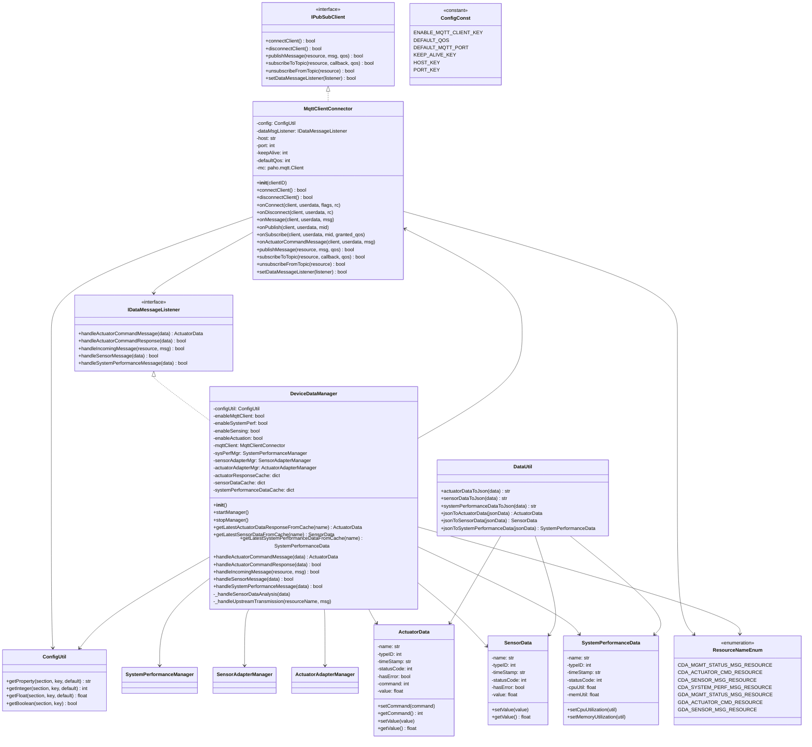

# Lab Module 06 - MQTT Client (CDA)

## Overview

Lab Module 06 implements MQTT (Message Queuing Telemetry Transport) client functionality for the Constrained Device Application (CDA). This enables the CDA to communicate with an MQTT broker for publishing sensor/performance data and subscribing to actuator commands.

## Objectives

- Implement MqttClientConnector using the paho-mqtt library
- Handle MQTT connection, disconnection, and network events
- Implement publish and subscribe functionality with QoS validation
- Integrate MQTT client into DeviceDataManager
- Enable pub/sub messaging between CDA and GDA via MQTT broker

## Code Repository and Branch
https://github.com/donald4u/cda-python-components/tree/labmodule06

## Class Diagram



## Testing

### Unit Tests
Run individual MQTT client tests:
```bash
python -m pytest tests/integration/connection/test_MqttClientConnector.py -v
```

### Available Tests
- testConnectAndDisconnect: Basic connection/disconnection
- testConnectAndCDAManagementStatusPubSub: Pub/Sub to management status topic
- testNewActuatorCmdPubSub: Actuator command pub/sub with JSON
- testActuatorCmdPubSub: Actuator command with specific value
- testSensorMsgPub: Sensor data publication
- testCDAManagementStatusSubscribe: Subscribe to management commands
- testCDAActuatorCmdSubscribe: Subscribe to actuator commands (300s)
- testCDAManagementStatusPublish: Publish management status

### Integration Test
Run the full CDA with MQTT:
```bash
python programmingtheiot/cda/app/ConstrainedDeviceApp.py
```

Expected output:
- MQTT client created and connected
- Subscribed to actuator command topic
- System performance data collected every 5 seconds
- CDA ready to receive actuator commands via MQTT

## Environment

- **Python:** 3.12.3
- **Libraries:** paho-mqtt, APScheduler, psutil, numpy
- **MQTT Broker:** Mosquitto 2.0.18
- **Testing:** pytest, unittest

## Test Results

- Ran 2 tests in 140.180s
- Status: OK (2 passed, 6 skipped)
- MQTT connectivity verified
- Pub/sub messaging verified
- QoS validation verified
- Message waiting (wait_for_publish) verified

## References

- [MQTT 3.1.1 Specification](http://docs.oasis-open.org/mqtt/mqtt/v3.1.1/mqtt-v3.1.1.html)
- [Paho Python Client](https://github.com/eclipse/paho.mqtt.python)
- Programming the Internet of Things - Chapter 6
