# Accelerometer-Based Tilt Detection System

## Project Overview

This project implements an accelerometer-based tilt detection system for data center physical security monitoring using the Constrained Device Application (CDA). The system monitors device orientation (pitch, roll, yaw) in real-time, triggers visual alerts when tilt thresholds are exceeded, and transmits telemetry data to the Ubidots cloud platform for remote monitoring.

### Use Case: Data Center Security

Unauthorized physical access to server racks often involves tilting or moving equipment. This system detects such movements by:
- Continuously monitoring device orientation using the SenseHAT accelerometer
- Triggering immediate visual alerts (LED matrix) when tilt exceeds configured thresholds
- Sending real-time telemetry to cloud dashboard for remote security monitoring
- Providing individual axis data (pitch, roll, yaw) for detailed movement analysis

## Code Repository Branch
- https://github.com/donaldirebo/cda-python-components/tree/project

## Architecture and Class Diagram

```mermaid
classDiagram
    direction TB
    
    %% Application Layer
    class ConstrainedDeviceApp {
        -deviceDataManager: DeviceDataManager
        -configUtil: ConfigUtil
        +__init__()
        +startApp(): bool
        +stopApp(): bool
    }
    
    %% Manager Layer
    class DeviceDataManager {
        -configUtil: ConfigUtil
        -enableSystemPerf: bool
        -enableSensing: bool
        -enableActuation: bool
        -sensorAdapterManager: SensorAdapterManager
        -actuatorAdapterManager: ActuatorAdapterManager
        -mqttClient: MqttClientConnector
        -sensorDataCache: dict
        +__init__()
        +startManager(): bool
        +stopManager(): bool
        +handleSensorMessage(data: SensorData): bool
        +handleActuatorCommandResponse(data: ActuatorData): bool
    }
    
    class SensorAdapterManager {
        -scheduler: BackgroundScheduler
        -humidityAdapter: HumiditySensorSimTask
        -pressureAdapter: PressureSensorSimTask
        -tempAdapter: TemperatureSensorSimTask
        -accelerometerAdapter: AccelerometerSensorEmulatorTask
        -dataMsgListener: IDataMessageListener
        -pollCycleSecs: int
        -useEmulator: bool
        -locationID: str
        +__init__()
        +handleTelemetry()
        +setDataMessageListener(listener: IDataMessageListener): bool
        +startManager(): bool
        +stopManager(): bool
    }
    
    class ActuatorAdapterManager {
        -humidifierActuator: HumidifierEmulatorTask
        -hvacActuator: HvacEmulatorTask
        -ledActuator: LedDisplayEmulatorTask
        -tiltAlertActuator: TiltAlertActuatorTask
        -dataMsgListener: IDataMessageListener
        -useEmulator: bool
        +__init__()
        +sendActuatorCommand(data: ActuatorData): bool
        +setDataMessageListener(listener: IDataMessageListener): bool
    }
    
    %% Sensor Tasks
    class BaseSensorSimTask {
        <<abstract>>
        #name: str
        #typeID: int
        #latestSensorData: SensorData
        +__init__(name, typeID)
        +getName(): str
        +getTypeID(): int
        +generateTelemetry(): SensorData*
    }
    
    class AccelerometerSensorEmulatorTask {
        -sh: SenseHat
        -dataMessageListener: IDataMessageListener
        -latestPitch: float
        -latestRoll: float
        -latestYaw: float
        +__init__(dataSet)
        +generateTelemetry(): SensorData
        +setDataMessageListener(listener)
        -_sendAxisData(pitch, roll, yaw)
    }
    
    %% Actuator Tasks
    class BaseActuatorSimTask {
        <<abstract>>
        #name: str
        #typeID: int
        #simpleName: str
        #latestActuatorData: ActuatorData
        +__init__(name, typeID, simpleName)
        +getName(): str
        +getTypeID(): int
        +updateActuator(data: ActuatorData): ActuatorData
        #_activateActuator(val, stateData): int*
        #_deactivateActuator(val, stateData): int*
    }
    
    class TiltAlertActuatorTask {
        -sh: SenseHat
        +__init__()
        #_activateActuator(val, stateData): int
        #_deactivateActuator(val, stateData): int
    }
    
    %% Data Classes
    class SensorData {
        -name: str
        -typeID: int
        -value: float
        -timeStamp: str
        -statusCode: int
        -hasError: bool
        -locationID: str
        -latitude: float
        -longitude: float
        -elevation: float
        +__init__(name, typeID)
        +getValue(): float
        +setValue(val: float)
        +getName(): str
        +setName(name: str)
        +setLocationID(id: str)
        +updateTimeStamp()
    }
    
    class ActuatorData {
        -name: str
        -typeID: int
        -command: int
        -value: float
        -stateData: str
        -statusCode: int
        +__init__(name, typeID)
        +getCommand(): int
        +setCommand(cmd: int)
        +getValue(): float
        +setValue(val: float)
    }
    
    %% Connection Classes
    class MqttClientConnector {
        -client: MqttClient
        -host: str
        -port: int
        -dataMsgListener: IDataMessageListener
        +__init__()
        +connectClient(): bool
        +disconnectClient(): bool
        +publishMessage(topic, payload, qos): bool
        +subscribeToTopic(topic, qos): bool
        +setDataMessageListener(listener)
    }
    
    %% Interfaces
    class IDataMessageListener {
        <<interface>>
        +handleSensorMessage(data: SensorData): bool
        +handleActuatorCommandResponse(data: ActuatorData): bool
    }
    
    %% External Systems
    class SenseHat {
        <<external>>
        +get_orientation(): dict
        +set_pixels(matrix: list)
        +clear(color)
    }
    
    class ConfigConst {
        <<constants>>
        +ACCELEROMETER_SENSOR_NAME = "AccelerometerSensor"
        +ACCELEROMETER_SENSOR_TYPE = 1014
        +PITCH_SENSOR_TYPE = 1015
        +ROLL_SENSOR_TYPE = 1016
        +YAW_SENSOR_TYPE = 1017
        +TILT_ALERT_ACTUATOR_NAME = "TiltAlertActuator"
        +TILT_ALERT_ACTUATOR_TYPE = 1003
        +HANDLE_TILT_CHANGE_ON_DEVICE_KEY
        +TRIGGER_TILT_MAX_ANGLE_KEY
    }
    
    %% Relationships
    ConstrainedDeviceApp --> DeviceDataManager : creates & manages
    
    DeviceDataManager ..|> IDataMessageListener : implements
    DeviceDataManager --> SensorAdapterManager : manages sensors
    DeviceDataManager --> ActuatorAdapterManager : manages actuators
    DeviceDataManager --> MqttClientConnector : publishes data
    DeviceDataManager ..> SensorData : processes
    DeviceDataManager ..> ActuatorData : creates commands
    
    SensorAdapterManager --> AccelerometerSensorEmulatorTask : polls telemetry
    SensorAdapterManager --> IDataMessageListener : forwards data
    
    ActuatorAdapterManager --> TiltAlertActuatorTask : sends commands
    ActuatorAdapterManager --> IDataMessageListener : reports responses
    
    AccelerometerSensorEmulatorTask --|> BaseSensorSimTask : extends
    AccelerometerSensorEmulatorTask --> SenseHat : reads orientation
    AccelerometerSensorEmulatorTask ..> SensorData : creates
    AccelerometerSensorEmulatorTask --> IDataMessageListener : sends axis data
    
    TiltAlertActuatorTask --|> BaseActuatorSimTask : extends
    TiltAlertActuatorTask --> SenseHat : controls LED matrix
    
    %% ConfigConst Dependencies
    AccelerometerSensorEmulatorTask ..> ConfigConst : uses constants
    TiltAlertActuatorTask ..> ConfigConst : uses constants
    DeviceDataManager ..> ConfigConst : uses config keys
    SensorAdapterManager ..> ConfigConst : uses constants
    ActuatorAdapterManager ..> ConfigConst : uses constants
```

## Testing

### Unit Test

```bash
cd ~/piot/cda-python-components
source venv/bin/activate
python -m pytest src/test/python/programmingtheiot/part03/integration/
```

## Running the Application

### Prerequisites

- Python 3.8+
- SenseHAT Emulator (`sense-emu`)
- MQTT Broker (Mosquitto) running on localhost
- GDA running for cloud connectivity

### Start the System

**Terminal 1 - MQTT Broker:**
```bash
mosquitto
```

**Terminal 2 - GDA:**
```bash
cd ~/piot/gda-java-components
mvn exec:java -Dexec.mainClass="programmingtheiot.gda.app.GatewayDeviceApp"
```

**Terminal 3 - CDA:**
```bash
cd ~/piot/cda-python-components
source venv/bin/activate
python -m programmingtheiot.cda.app.ConstrainedDeviceApp
```

**Terminal 4 - SenseHAT Emulator:**
```bash
sense_emu_gui &
```

### Testing Tilt Detection

1. Open the SenseHAT Emulator GUI
2. Navigate to the **Orientation** tab
3. Move **Pitch** or **Roll** sliders beyond 15°
4. Observe:
   - LED matrix lights up red (tilt alert)
   - CDA terminal shows `ACCELEROMETER READ` with orientation values
   - Ubidots dashboard displays real-time data

## Ubidots Cloud Integration

### Variables Sent to Cloud

| Variable | Description |
|----------|-------------|
| `sensormsg-accelerometersensor` | Maximum tilt angle (max of pitch/roll) |
| `sensormsg-pitchsensor` | Pitch angle in degrees |
| `sensormsg-rollsensor` | Roll angle in degrees |
| `sensormsg-yawsensor` | Yaw angle in degrees |


## Author

Donald Chinonso Irebo- Northeastern University, Toronto
Course: Programming the Internet of Things (PIOT)  
Term: Fall 2025
