# Gateway Device Application - Accelerometer Tilt Detection Support

## Project Overview

The Gateway Device Application (GDA) serves as the middleware between the Constrained Device Application (CDA) and the Ubidots cloud platform. For the accelerometer-based tilt detection project, the GDA receives sensor telemetry from the CDA via MQTT, processes the data, and forwards it to Ubidots for cloud-based monitoring and visualization.

### Role in the Tilt Detection System

The GDA performs the following functions:
- Receives accelerometer data (pitch, roll, yaw, max tilt) from CDA via local MQTT broker
- Deserializes JSON sensor data into SensorData objects
- Forwards sensor telemetry to Ubidots cloud via secure MQTT (TLS)
- Receives LED actuation commands from Ubidots dashboard
- Routes actuation commands back to CDA for local execution
## Code Repository Branch
- https://github.com/donaldirebo/gda-java-components/tree/project

## Architecture and Class Diagram

```mermaid
classDiagram
    direction TB
    
    %% Application Layer
    class GatewayDeviceApp {
        -deviceDataManager: DeviceDataManager
        -sysPerfManager: SystemPerformanceManager
        +GatewayDeviceApp(args: String[])
        +startApp(): void
        +stopApp(exitCode: int): void
        +main(args: String[]): void$
        -parseArgs(args: String[]): Map
    }
    
    %% Manager Layer
    class DeviceDataManager {
        -configUtil: ConfigUtil
        -enableMqttClient: boolean
        -enableCoapServer: boolean
        -enableCoapClient: boolean
        -enableCloudClient: boolean
        -mqttClient: MqttClientConnector
        -coapServer: CoapServerGateway
        -coapClient: CoapClientConnector
        -cloudClient: ICloudClient
        +DeviceDataManager()
        +startManager(): void
        +stopManager(): void
        +handleSensorMessage(resource, data): boolean
        +handleSystemPerformanceMessage(resource, data): boolean
        +handleIncomingMessage(resource, msg): boolean
        -initConnections(): void
        -handleUpstreamTransmission(resource, data): void
        -handleIncomingDataAnalysis(resource, data): void
    }
    
    class SystemPerformanceManager {
        -cpuUtilTask: SystemCpuUtilTask
        -memUtilTask: SystemMemUtilTask
        -scheduler: ScheduledExecutorService
        -pollSecs: int
        +startManager(): void
        +stopManager(): void
        +handleTelemetry(): void
    }
    
    %% Connection Classes
    class MqttClientConnector {
        -client: MqttClient
        -brokerAddr: String
        -clientID: String
        -dataMsgListener: IDataMessageListener
        -connListener: IConnectionListener
        -useCloudGatewayConfig: boolean
        +MqttClientConnector()
        +MqttClientConnector(useCloudGatewayConfig: boolean)
        +connectClient(): boolean
        +disconnectClient(): boolean
        +publishMessage(topic, payload, qos): boolean
        +subscribeToTopic(topic, qos, listener): boolean
        +unsubscribeFromTopic(topic): boolean
        +setDataMessageListener(listener): void
        +setConnectionListener(listener): void
        -initClientParameters(): void
        -initSecureConnectionParameters(): void
        -initCredentialConnectionParameters(): void
    }
    
    class CloudClientConnector {
        -mqttClient: MqttClientConnector
        -topicPrefix: String
        -dataMsgListener: IDataMessageListener
        +CloudClientConnector()
        +connectClient(): boolean
        +disconnectClient(): boolean
        +sendEdgeDataToCloud(resource, data): boolean
        +setDataMessageListener(listener): boolean
        +onConnect(): void
    }
    
    class CoapServerGateway {
        -coapServer: CoapServer
        -dataMsgListener: IDataMessageListener
        +CoapServerGateway()
        +startServer(): boolean
        +stopServer(): boolean
        +setDataMessageListener(listener): boolean
        -initServer(): void
    }
    
    class CoapClientConnector {
        -coapClient: CoapClient
        -serverAddr: String
        +CoapClientConnector()
        +sendGetRequest(resource): String
        +sendPostRequest(resource, payload): boolean
        +sendPutRequest(resource, payload): boolean
        +sendDeleteRequest(resource): boolean
        -initClient(): void
    }
    
    %% Data Classes
    class SensorData {
        -name: String
        -typeID: int
        -value: float
        -timeStamp: String
        -statusCode: int
        -hasError: boolean
        -locationID: String
        -latitude: float
        -longitude: float
        -elevation: float
        +SensorData()
        +SensorData(sensorType: int)
        +getValue(): float
        +setValue(val: float): void
        +getName(): String
        +setName(name: String): void
        +getTypeID(): int
        +setTypeID(typeID: int): void
        +toString(): String
        #handleUpdateData(data: BaseIotData): void
    }
    
    class SystemPerformanceData {
        -cpuUtil: float
        -memUtil: float
        -diskUtil: float
        +getCpuUtilization(): float
        +setCpuUtilization(val: float): void
        +getMemoryUtilization(): float
        +setMemoryUtilization(val: float): void
    }
    
    class ActuatorData {
        -name: String
        -typeID: int
        -command: int
        -value: float
        -stateData: String
        -statusCode: int
        +getCommand(): int
        +setCommand(cmd: int): void
        +getValue(): float
        +setValue(val: float): void
    }
    
    %% Utility Classes
    class DataUtil {
        -gson: Gson
        -instance: DataUtil$
        +getInstance(): DataUtil$
        +sensorDataToJson(data: SensorData): String
        +jsonToSensorData(json: String): SensorData
        +systemPerformanceDataToJson(data): String
        +jsonToSystemPerformanceData(json): SystemPerformanceData
        +actuatorDataToJson(data: ActuatorData): String
        +jsonToActuatorData(json: String): ActuatorData
    }
    
    class ConfigUtil {
        -props: Properties
        -instance: ConfigUtil$
        +getInstance(): ConfigUtil$
        +getProperty(section, key): String
        +getBoolean(section, key): boolean
        +getInteger(section, key): int
        +getFloat(section, key): float
        +getCredentials(section): Properties
    }
    
    class ConfigConst {
        <<constants>>
        +GATEWAY_DEVICE: String$
        +CONSTRAINED_DEVICE: String$
        +ENABLE_MQTT_CLIENT_KEY: String$
        +ENABLE_CLOUD_CLIENT_KEY: String$
        +ACCELEROMETER_SENSOR_TYPE: int$ = 1014
        +DEFAULT_VAL: float$ = 0.0
    }
    
    %% Interfaces
    class IDataMessageListener {
        <<interface>>
        +handleSensorMessage(resource, data): boolean
        +handleSystemPerformanceMessage(resource, data): boolean
        +handleActuatorCommandResponse(resource, data): boolean
        +handleIncomingMessage(resource, msg): boolean
    }
    
    class ICloudClient {
        <<interface>>
        +connectClient(): boolean
        +disconnectClient(): boolean
        +sendEdgeDataToCloud(resource, data): boolean
        +setDataMessageListener(listener): boolean
    }
    
    class IConnectionListener {
        <<interface>>
        +onConnect(): void
        +onDisconnect(): void
    }
    
    %% Inner Classes for MQTT Message Handling
    class SensorDataMessageListener {
        <<inner class>>
        -resource: ResourceNameEnum
        -dataMsgListener: IDataMessageListener
        +messageArrived(topic, message): void
    }
    
    class SystemPerformanceDataMessageListener {
        <<inner class>>
        -resource: ResourceNameEnum
        -dataMsgListener: IDataMessageListener
        +messageArrived(topic, message): void
    }
    
    %% External Systems
    class MqttBroker {
        <<external>>
        +localhost:1883
        +publish()
        +subscribe()
    }
    
    class UbidotsCloud {
        <<external>>
        +industrial.api.ubidots.com:8883
        +receiveData()
        +sendActuatorCommand()
    }
    
    %% Relationships - Application Layer
    GatewayDeviceApp --> DeviceDataManager : creates & manages
    GatewayDeviceApp --> SystemPerformanceManager : creates & manages
    
    %% Relationships - DeviceDataManager
    DeviceDataManager ..|> IDataMessageListener : implements
    DeviceDataManager --> MqttClientConnector : local MQTT
    DeviceDataManager --> CloudClientConnector : cloud connection
    DeviceDataManager --> CoapServerGateway : CoAP server
    DeviceDataManager --> CoapClientConnector : CoAP client
    DeviceDataManager ..> SensorData : processes
    DeviceDataManager ..> ActuatorData : processes
    DeviceDataManager ..> ConfigUtil : uses
    
    %% Relationships - Cloud
    CloudClientConnector ..|> ICloudClient : implements
    CloudClientConnector ..|> IConnectionListener : implements
    CloudClientConnector --> MqttClientConnector : secure MQTT
    CloudClientConnector --> UbidotsCloud : publishes data
    
    %% Relationships - MQTT
    MqttClientConnector --> MqttBroker : connects
    MqttClientConnector --> SensorDataMessageListener : creates
    MqttClientConnector --> SystemPerformanceDataMessageListener : creates
    MqttClientConnector ..> IDataMessageListener : notifies
    
    %% Relationships - Message Listeners
    SensorDataMessageListener ..> DataUtil : uses
    SensorDataMessageListener ..> SensorData : creates
    SystemPerformanceDataMessageListener ..> DataUtil : uses
    SystemPerformanceDataMessageListener ..> SystemPerformanceData : creates
    
    %% Relationships - Utilities
    DataUtil ..> SensorData : serializes/deserializes
    DataUtil ..> ActuatorData : serializes/deserializes
    DataUtil ..> SystemPerformanceData : serializes/deserializes
    
    %% Relationships - ConfigConst
    SensorData ..> ConfigConst : uses constants
    DeviceDataManager ..> ConfigConst : uses constants
    MqttClientConnector ..> ConfigConst : uses constants
    CloudClientConnector ..> ConfigConst : uses constants
```

## Running the Application

### Prerequisites

- Java 11+
- Maven 3.6+
- MQTT Broker (Mosquitto) running on localhost:1883
- Ubidots account with API token and TLS certificate

### Start the GDA

```bash
cd ~/piot/gda-java-components
mvn exec:java -Dexec.mainClass="programmingtheiot.gda.app.GatewayDeviceApp"
```

## Integration Testing

### Full System Test

1. **Start MQTT Broker:**
   ```bash
   mosquitto
   ```

2. **Start GDA:**
   ```bash
   cd ~/piot/gda-java-components
   mvn exec:java -Dexec.mainClass="programmingtheiot.gda.app.GatewayDeviceApp"
   ```

3. **Start CDA:**
   ```bash
   cd ~/piot/cda-python-components
   source venv/bin/activate
   python -m programmingtheiot.cda.app.ConstrainedDeviceApp
   ```

4. **Open SenseHAT Emulator:**
   ```bash
   sense_emu_gui &
   ```

5. **Tilt the emulator** (Pitch/Roll > 15°) and verify:
   - GDA logs show non-zero sensor values
   - Ubidots dashboard updates with accelerometer data
   - LED matrix activates on threshold breach

## Author

Donald Chinonso Irebo- Northeastern University, Toronto
Course: Programming the Internet of Things (PIOT)  
Term: Fall 2025
